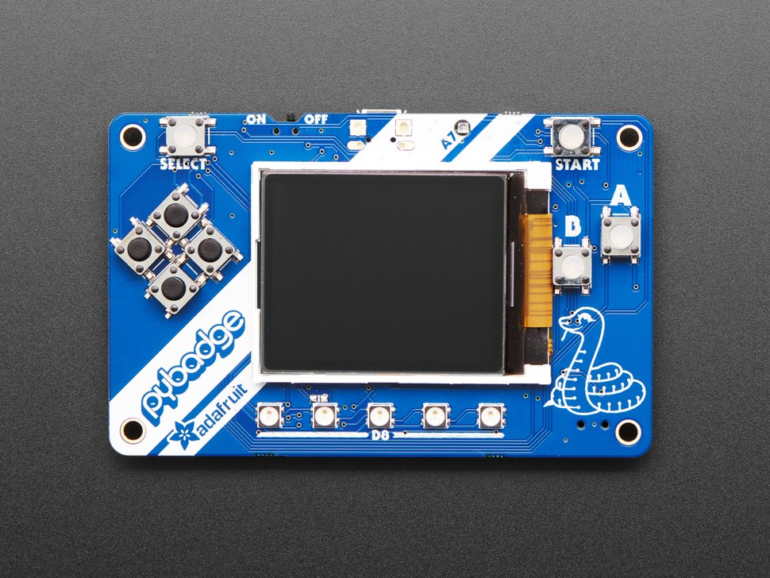
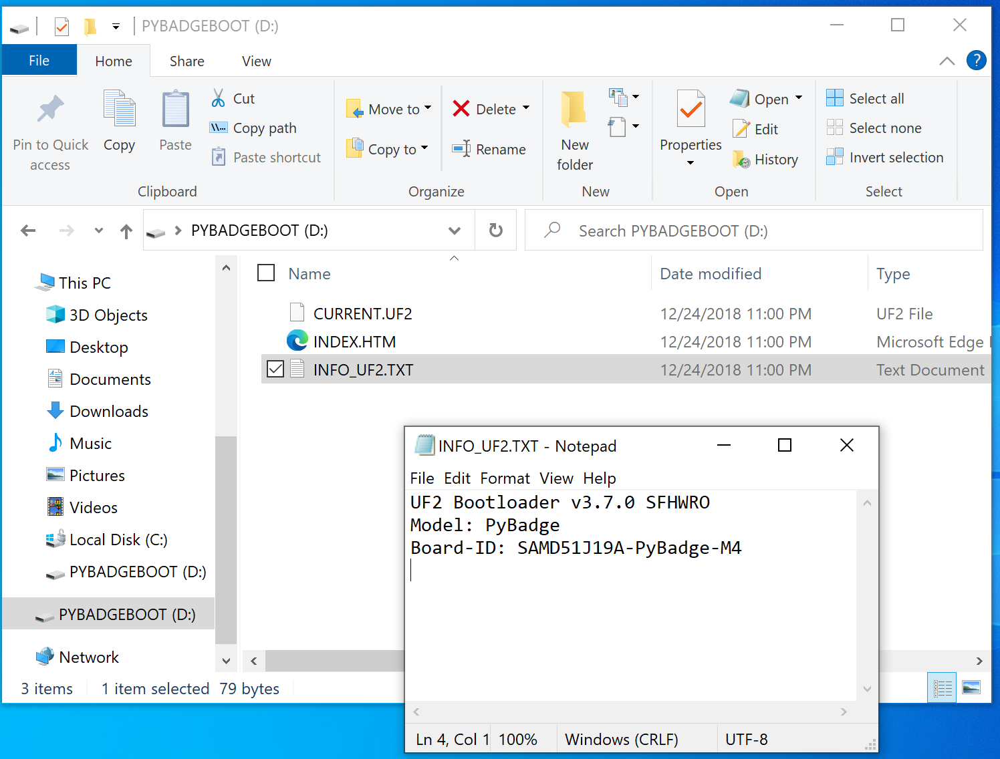
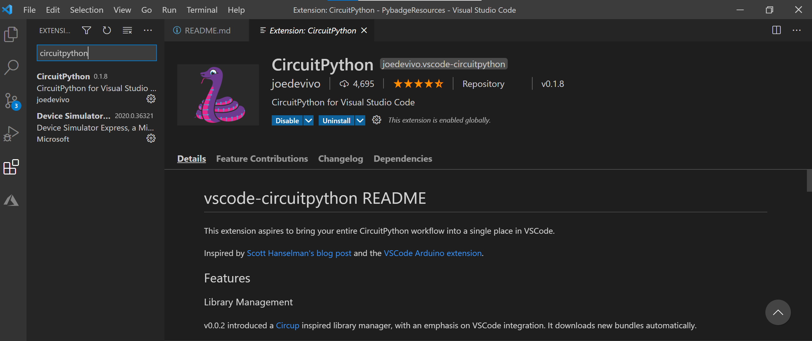
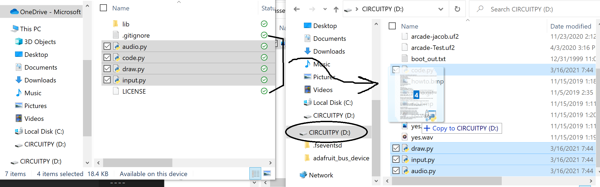
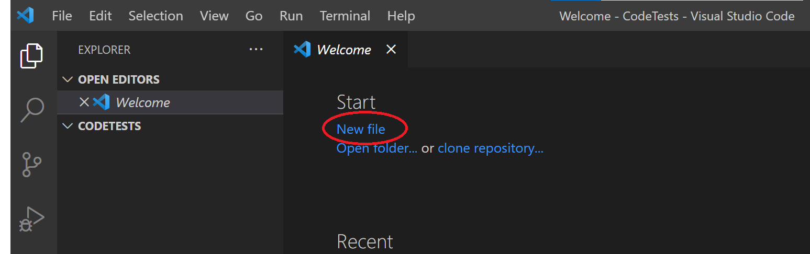

# Getting started with VS Code

> This repo provides an overview of how to program the PyBadge with [Microsoft VS Code](https://code.visualstudio.com/). This learning path is intended for folks with some experience coding. If you're new to coding, we recommend the MakeCode pathway. 


This doc gives general information and guidance on how to program the PyBadge with VS Code. We will focus on the CircuitPython language, but you can also use C/C++.

The full getting started guide for the PyBadge can be found on [Adafruit's Learn website here](https://learn.adafruit.com/adafruit-pybadge).

### What's VS Code??
VS Code is a lightweight, powerful code editing platform used by all types of developers from hobbyists to professionals. It supports a wide variety of languages including Java, JavaScript, Go, Node.js, Python and C++.

VS Code features include support for debugging, syntax highlighting, intelligent code completion,  and embedded Git. Users can change the theme, keyboard shortcuts, preferences, and install extensions that add additional functionality.

### What's CircuitPython??
CircuitPython is a derivative of MicroPython designed to simplify experimentation and education on low-cost microcontrollers. It is a popular language for hardware developed and maintained by Adafruit and their community. 


## Contents
| Section     | Description                                |
|-------------------|--------------------------------------------|
|[Introduction](##Introduction) | More information about the PyBadge, including what's on the board. |
| [PyBadge Setup](##PyBadge-Setup) | Setting up the PyBadge and downloading CircuitPython libraries|
| [VS Code Setup](##VS-Code-Setup) | Setting up VS Code for the first time |
| [Suggested Learning Path](##Suggested-Learning-Path) | This section provides a brief curriculum with project-based resources for art, games, and sensors.


## Introduction
Congratulations, you've got yourself a PyBadge! The PyBadge is device called a *microcontroller,* a simple computer that we can program to do all sorts of fun things, like custom video games, musical instruments, and more!

We can program the PyBadge using Microsoft VS Code, a robust and free source-code editor made by Microsoft for Windows, Linux and macOS. Read on to learn more about the board and what you can make with it!

### What's on the board



* Color screen display (1.8" 160x128 Color TFT Display) 
* 8 x Game/Control Buttons 
* Light sensor (on front) 
* Buzzer mini-speaker
* Triple-axis accelerometer (motion sensor)
* 5 x NeoPixels (lights that can change colors!)
* LiPoly battery port (recharging capabilities)
* USB port for battery charging, programming and debugging
* Mono Class-D speaker driver for 4-8 ohm speakers, up to 2 Watts
    * Like [this](https://www.adafruit.com/product/1313) or [this](https://www.adafruit.com/product/4227) speaker!
* Reset button
* On-Off switch

For the full list of features, [visit this site](https://www.adafruit.com/product/4200).

## PyBadge Setup
**NOTE: Make sure you're using a data transfer USB cable and not a charge-only cable.**


1. Click the reset button (on back) so that the PyBadge shows up as a device on your computer, like a USB stick!
    * If a single click doesn't work, try double-click.
2. You may need to update the bootloader on the PyBadge, *esp* if you're working on a Mac. 
    * From Adafruit: "To see if you need to update your bootloader, get the UF2 boot drive to appear on your board. **If the boot drive is named ARCADE-D51 or BADGEBOOT, you definitely need to upgrade.** 
    * If you see PYBADGEBOOT, click the PYBADGEBOOT drive in the Finder and then double-click the ```INFO_UF2.TXT``` file to see what's inside. The bootloader version is listed in ```INFO_UF2.TXT```.

    

    * If the bootloader version you see is older than v3.9.0, like the one shown above, you need to update. 
    * [Download the latest version of the PyBadge bootloader updater here](https://circuitpython.org/board/pybadge/). Scroll down until you see "UF2 Bootloader"

    * Drag the downloaded bootloader UF2 file onto the PyBadge drive. While downloading, the PyBadge's status LED will flicker red, and the NeoPixels will flash and turn green. 
    * When you see PYBADGEBOOT appear, click on the folder and open ```INFO_UF2.TXT```  to confirm the bootloader updated. 
   
    * For more info, [visit the full Adafruit tutorial.](https://learn.adafruit.com/adafruit-pybadge/updating-the-bootloader)

3. Configure the board for CircuitPython.
    * Download the [latest CircuitPython release for the PyBadge here](https://circuitpython.org/board/pybadge/).
    * Drag the downloaded CircuitPython UF2 file onto the PyBadge drive.
    * While downloading, the status LED will flicker and, when it's finished, the device name will change to CIRCUITPY.
    * For more info or troubleshooting tips, [visit the Adafruit tutorial.](https://learn.adafruit.com/adafruit-pybadge/installing-circuitpython)

### Download CircuitPython Libraries
While we're setting up the PyBadge, let's grab the full suite of CircuitPython libraries! These allow us to quickly access a wide variety of libaries to more easily program the NeoPixels, pushbuttons, sensors, and more!

**[Download the latest full CircuitPython library set here](https://circuitpython.org/libraries),** then unzip the files.

*Note: Download the first link under "Bundle Version 6.x".*
    

## VS Code Setup
1. Download VS Code for free [here](https://code.visualstudio.com/Download).



2. Open VS Code and go to the "Extensions" tab on the left vertical menu (the little stacked blocks near the bottom).
3. Search for and install the "CircuitPython" extension.

## Suggested Learning Path
### Lesson 0: Quick Start

  Once your board is set up for CircuitPython, we can load CircuitPython code and libraries onto the board and they will run automatically! 
  
  Let's start with an interactive game: a digital Etch-A-Sketch! This will show you what's possible with the screen, buttons, and NeoPixels. It will also give an intro to using libraries, which is the key to mastering any programming language.

**Estimated Time:** 30 - 45 min 

#### Key concepts:
* How to load code onto the PyBadge
* Intro to reading code
* Basics of reading error messages

#### Procedure

1. [Download the game files here.](https://github.com/adafruit/Adafruit_CircuitPython_Bundle/releases/download/20201229/adafruit-circuitpython-bundle-6.x-mpy-20201229.zip)
    * NOTE: the link above opens a zip file download. If you prefer to manually download, go to the [Digital Etch-a-Sketch GitHub repo here](https://github.com/benbenbob1/Etch-a-Sketch-PyBadge), click the green 'Code' button and select "Download ZIP" in the drop-down menu. 



2. Unzip and open the Etch-a-Sketch folder. First, we need to load the libraries the game needs:
    * Open the 'lib' folder. Select and drag the ```adafruit_bus_device``` folder and the ```adafruit_lis3dh.mpy``` file onto the PyBadge drive.
    * Go back to the main folder. Select and drag all four ```.py``` files onto the PyBadge:  ```audio.py```, ```code.py```, ```draw.py```, and ```input.py``` 
3. That's it! You should see some text on the PyBadge screen as the code loads. When files are done loading, the NeoPixels should be red and you should see a red blinking dot in the middle of the screen.
4. Use the four buttons on the left to move the cursor and draw as you go! Explore what happens when you push the A and B buttons! What else does the code cause the board to do?
5.  Read through ```code.py``` and see what information you can understand. What do you notice about the syntax? Where do you think the button functions are defined? Where do you see familiar words or phrases? 
    * This exercise is great in partner or small groups, with participants sharing their questions, ideas, and discoveries.
6. Try changing the name of ```code.py``` and see what happens. Try changing the name of the other Python files! What sorts of error messages are displayed?
    * If time, try changing something in one of the Python files and reloading the files onto the PyBadge. What is the output? 
    * Repeat this process and see how the PyBadge output changes. What information can you gather from this?


#### Instructor Tips
* Practice loading the code onto the PyBadge prior to the workshop. This will help you learn potential friction points for participants and make in-class debugging faster.
* For this first lesson, the most important takeaways are:
    1. The main PyBadge program **must be named ```code.py``` exactly as-is** in all lowercase. 
    2. Code files and libraries are added to the PyBadge by dragging and dropping the files onto the PyBadge drive.
    3. Error messages may be displayed on the PyBadge output. These are invaluable for debugging.
* If you are comfortable with the terminology,  define concepts for participants as you go. If not, encourage participants to look up words/phrases like 'code library', 'function', 'variable', and 'python data types'. 
    * If you want to learn more about Python, check out [this beginner-friendly course on MS Learn](https://docs.microsoft.com/en-us/learn/modules/intro-to-python/)
*  Facilitate a class discussion at the end where participants can share their discoveries and any remaining mysteries. 

### Lesson 1: Intro to Coding Concepts using CircuitPython
Physical computing is a fun, engaging way to learn the fundamentals of software! This lesson teaches students the basics of using VS Code while covering helpful topics in programming: reading and editing code and importing other code, like libraries.

This is just one of many pathways for lessons with the PyBadge. We recommend leveraging participant interests and experience and giving plenty of time open-ended exploration which results in deeper learning and a more engaged experience.

**Estimated Time:** 60 - 90 min

#### Key Concepts:
1. How to use VS Code;
2. Reading and editing code; and
3. Imports and libraries.

#### Procedure
1. Create a folder on the local computer where your code will be saved.



2. Open VS Code. In the *File* menu, select *Open Folder* and open the folder you created in Step 1.
3. At the top of the main screen, select "New File" under *Start*.
4. Copy and paste the following code into the new file:
    ```import board
    import digitalio
    import time
    
    led = digitalio.DigitalInOut(board.D13)
    led.direction = digitalio.Direction.OUTPUT
    
    while True:
        led.value = True
        time.sleep(0.5)
        led.value = False
        time.sleep(0.5)
5. Save the file as ```code.py```. Plug in the PyBadge and drag the ```code.py``` file onto the PyBadge. When the PyBadge refreshes, flip the board over and observe the red status LED on the back.

6. Now let's edit the program! Open your ```code.py``` file in VS Code and change only the first 0.5 to 0.1 (in the ```time.sleep()``` parentheses). The code should look like this:
    ```import board
    import digitalio
    import time
    
    led = digitalio.DigitalInOut(board.D13)
    led.direction = digitalio.Direction.OUTPUT
    
    while True:
        led.value = True
        time.sleep(0.1)
        led.value = False
        time.sleep(0.5)

7. Save the changes and drag the file onto the PyBadge, replacing the existing ```code.py``` file. Look at the red status LED -- what do you notice? What changed? Try different numbers in ```time.sleep()``` and see what happens!

#### Let's learn more about code!
*This learning portion is adapted from the [Adafruit Learn CircuitPython tutorial](https://learn.adafruit.com/adafruit-pybadge/creating-and-editing-code).*

**Imports and Libraries**

Each CircuitPython program you run needs to have a lot of information to work. The reason CircuitPython is so simple to use is that most of that information is stored in other files and works in the background. The files built into CircuitPython are called **modules**, and the files you load separately are called **libraries**. Modules are built into CircuitPython. Libraries are stored on your CIRCUITPY drive in a folder called **lib**.

    import board
    import digitalio
    import time

The ```import``` statements tells the board that you're going to use a particular library in your code. In this example, we imported three modules: ```board```, ```digitalio```, and ```time```. All three of these modules are built into CircuitPython, so no separate library files are needed. That's one of the things that makes this an excellent first example. You don't need any thing extra to make it work! ```board``` gives you access to the hardware on your board, ```digitalio``` lets you access that hardware as inputs/outputs and ```time``` lets you pass time by 'sleeping'.

**Setting Up The LED**

The next two lines setup the code to use the LED.

    led = digitalio.DigitalInOut(board.D13)
    led.direction = digitalio.Direction.OUTPUT

Your board knows the red ```LED``` as ```D13```. We initialise that pin, and we set it to be an output. We set ```led``` to equal the rest of that information so we don't have to type it all out again later in our code.

**Loop-de-loops**

The third section starts with a ```while``` statement. ```while True:``` means "forever do the following things:". ```while True:``` creates a loop. Code will loop "while" the condition is "true" (vs. false), and as ```True``` is never ```False```, the code will loop forever. All code that is indented under ```while True:``` is "inside" the loop.

Inside our loop, we have four items:

    while True:
        led.value = True
        time.sleep(0.5)
        led.value = False
        time.sleep(0.5)
First, we have ```led.value = True```. This line tells the LED to turn on. On the next line, we have ```time.sleep(0.5)```. This line is telling CircuitPython to pause running code for 0.5 seconds. Since this is between turning the ```led``` on and off, the LED will be on for 0.5 seconds.

The next two lines are similar. ```led.value = False``` tells the LED to turn off, and ```time.sleep(0.5)``` tells CircuitPython to pause for another 0.5 seconds. This occurs between turning the LED off and back on so the LED will be off for 0.5 seconds too.

Then the loop will begin again, and continue to do so as long as the code is running!

When you changed the first 0.5 to 0.1, you decreased the amount of time that the code leaves the LED on. So it blinks on really quickly before turning off!

> Great job! You've edited code in a CircuitPython program!
> Now that you've seen how to load code and libraries onto the PyBadge, practice editing other folks' code and writing your own programs! 

### Lesson 2: Fundamental Concepts in Coding
*Coming soon!*

## Additional Projects and Guides
### Art and Games
* [Open-Ended Drawing Program](https://learn.adafruit.com/pypaint/overview)
    * This project shows you how to make an open-ended drawing program on the PyBadge screen which includes an on-screen color palette.
* [Making games in CircuitPython](https://learn.adafruit.com/circuitpython-stage-game-library)
    * This tutorial shows you how to make simple games in CircuitPython with the *Stage* library!
* [Making vector graphics](https://learn.adafruit.com/circuitpython-turtle-graphics)
    * This guide shows you how to make Turtle graphics, or vector graphics, similar to the kinds of patterns made by a spirograph.
* [Simple Name Badge](https://learn.adafruit.com/pybadger-event-badge/using-pybadger)


### Advanced Topics
* [Name Badge with Unicode Fonts](https://learn.adafruit.com/pybadge-conference-badge-multi-language-unicode-fonts/overview)
    * This guide shows you how to make a name badge using different fonts and languages! It also includes sample code on using NeoPixels and buttons.
* [Introduction to Machine Learning on the PyBadge](https://learn.adafruit.com/tensorflow-lite-for-edgebadge-kit-quickstart)
    * This tutorial shows you how to get simple Machine Learning (ML) programs running on the PyBadge, like a "Yes" or "No" audio detector!

